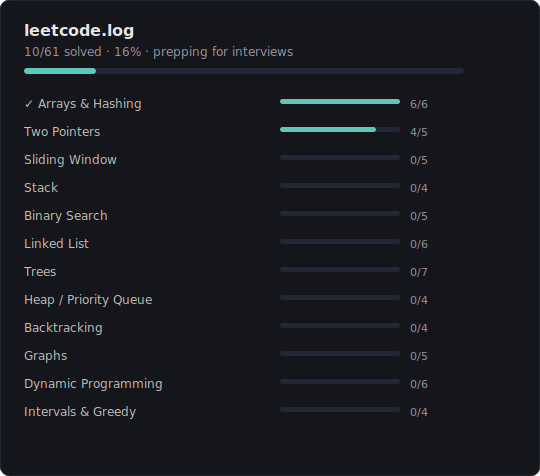

# leetcode.log

Solving LeetCode challenges by pattern — prepping for interviews.



## Structure

Each folder in `solutions/` maps to a pattern. File names match the problem slug on LeetCode.

```
solutions/
├── 01-arrays-and-hashing/
│   ├── two-sum.js
│   └── valid-anagram.js
├── 02-two-pointers/
│   └── valid-palindrome.js
└── ...
```

## How it works

1. Solve the problem on [LeetCode](https://leetcode.com) using JavaScript
2. Save the solution in the matching pattern folder
3. Push — the badge updates automatically via GitHub Actions

## Patterns

| # | Pattern | Problems |
|---|---------|----------|
| 01 | Arrays & Hashing | 6 |
| 02 | Two Pointers | 5 |
| 03 | Sliding Window | 5 |
| 04 | Stack | 4 |
| 05 | Binary Search | 5 |
| 06 | Linked List | 6 |
| 07 | Trees | 7 |
| 08 | Heap / Priority Queue | 4 |
| 09 | Backtracking | 4 |
| 10 | Graphs | 5 |
| 11 | Dynamic Programming | 6 |
| 12 | Intervals & Greedy | 4 |
